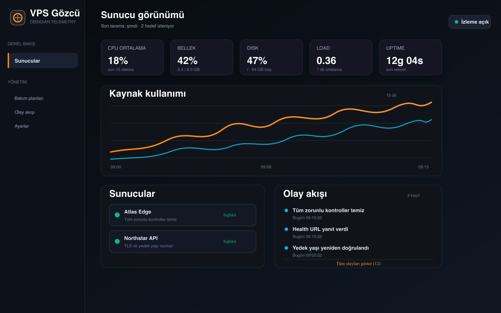

# VPS Gözcü

> Native, agentless VPS health monitoring for macOS — private by default.

[](https://www.apple.com/macos/)
[](https://www.swift.org/)
[](LICENSE)

VPS Gözcü, birden fazla Linux VPS'i mevcut SSH erişiminiz üzerinden izleyen native SwiftUI macOS uygulamasıdır. Ajan, merkezi veritabanı, Prometheus/Grafana veya ücretli servis gerektirmez. Mac kapalı ya da uykudayken veri toplamaz.



*Yukarıdaki ekran görüntüsü tamamen sentetik demo verisiyle hazırlanmıştır; gerçek sunucu, alan adı, IP veya kurum bilgisi içermez.*

## Öne çıkanlar

- Çoklu VPS profili ve menü çubuğu görünümü
- CPU, RAM, disk, load, kernel ve uptime ölçümleri
- Paket/güvenlik güncellemesi ve reboot gereksinimi görünürlüğü
- Docker, systemd, health URL ve yedek yaşı kontrolleri
- TLS sertifikası bitiş tarihi ve eşik tabanlı sağlık seviyeleri
- Kalıcı yerel metrik geçmişi, olay akışı ve kritik macOS bildirimleri
- Eksik ölçümleri yanlışlıkla `0` göstermeyen `Bilinmiyor` durumu
- Bakım akışlarını izleme akışından ayıran, backup-first onay kapısı

## Güvenlik sınırları

VPS Gözcü bir sunucu yönetim konsolu değil, gözlem aracıdır:

- SSH parolası veya private key uygulama verisine yazılmaz; sistem SSH yapılandırması ve macOS Keychain kullanılır.
- Host key doğrulaması açık kalır; bilinmeyen anahtarlar otomatik kabul edilmez.
- Uzak izleme komutları kaynak kodda sabittir ve salt-okunurdur; keyfi shell terminali yoktur.
- Güncelleme, reboot, Docker yeniden oluşturma ve deploy ayrı bakım akışlarıdır; hedef, yedek, ön koşul ve açık kullanıcı onayı olmadan çalıştırılmaz.
- Sunucu profilleri yalnızca yerel `servers.json` dosyasında tutulur; bu dosya `.gitignore` kapsamındadır.

Ayrıntılı tehdit modeli ve güvenli hata bildirimi için [SECURITY.md](SECURITY.md) dosyasına bakın.

## Hızlı başlangıç

Gereksinimler: macOS 14 veya üzeri ve Xcode Command Line Tools.

```bash
git clone https://github.com/mehmetyazicidev/vps-gozcu.git
cd vps-gozcu
swift test
swift run VPSGozcu
```

Projeyi Xcode ile açmak için `Package.swift` dosyasını açın. İlk açılışta **Sunucu Ekle** ekranından kendi SSH alias'ınızı, health URL'nizi ve yedek yollarınızı tanımlayın. Kaynak kodla gelen `servers.example.json` yalnızca şema örneğidir ve devre dışıdır.

Release paketinden kurulum, profil alanlarının açıklaması, menü çubuğu, eşikler, sorun giderme ve kaldırma adımları için [docs/USER_GUIDE.md](docs/USER_GUIDE.md) kullanım rehberine bakın.

Önce Terminal'de bağlantıyı doğrulayın:

```bash
ssh sunucu-takma-adi true
```

Uygulama verisi macOS'ta şu konumda tutulur:

```text
~/Library/Application Support/VPSGozcu/servers.json
```

## Geliştirme komutları

```bash
swift test                 # birim testleri
swift build -c release     # release derlemesi
./scripts/build-app.sh     # dist/ altında yerel .app
```

Developer ID imzası, notarization, stapling ve Gatekeeper doğrulaması için [docs/DISTRIBUTION.md](docs/DISTRIBUTION.md) belgesini izleyin. Resmî imzalı paketler kaynak depoya değil, GitHub Releases'a eklenmelidir.

## Mimari

```text
SwiftUI + MenuBarExtra
        │
        ▼
AppModel / zamanlayıcı ──► /usr/bin/ssh ──► sabit salt-okunur probe
        │                                      │
        └──── MonitoringStore ◄── ProbeParser ◄┘
                    │
          kartlar · grafikler · olaylar · bildirimler
```

Teknik ayrıntılar için [docs/ARCHITECTURE.md](docs/ARCHITECTURE.md) dosyasına bakın.

## Katkı

Katkı göndermeden önce [CONTRIBUTING.md](CONTRIBUTING.md) içindeki güvenlik ve test kontrol listesini okuyun. Gerçek hostname, IP, log, sertifika veya kimlik bilgilerini issue/PR içine koymayın.

## Lisans

Bu proje [MIT Lisansı](LICENSE) ile dağıtılır.

## Durum

İlk izleme ve yerel dağıtım akışı tamamlandı. Sonraki odak, sürüm yayın otomasyonu ve güvenli güncelleme kanalıdır. Uygulama 7/24 merkezi izleme hizmeti sunduğunu iddia etmez.
